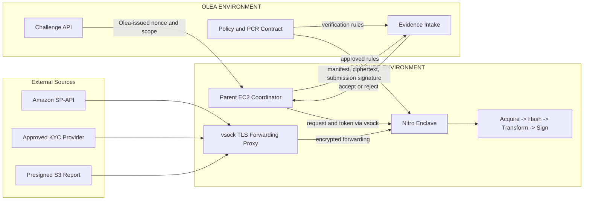
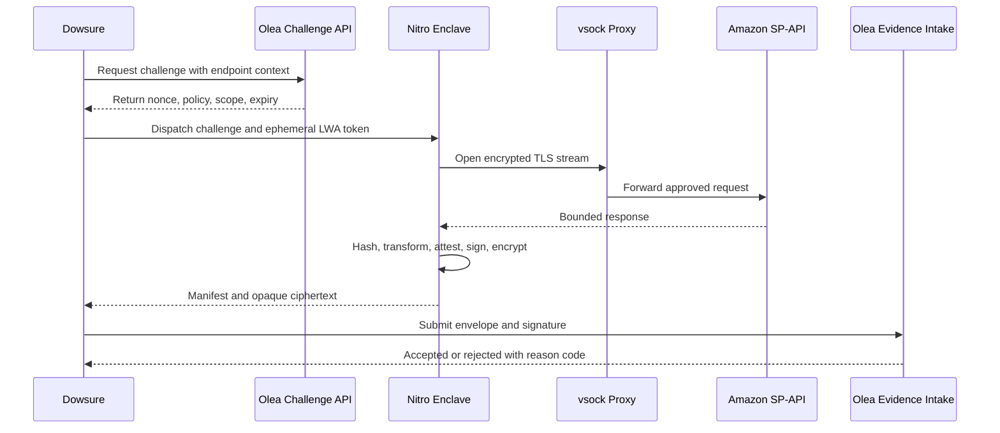

# Olea-Dowsure Verifiable Data Oracle

## 1. Architecture and Boundaries



### Boundary rules

- Dowsure calls Olea’s Challenge API; Olea generates the nonce, scope, policy version, and expiry.
- Dowsure must use only the returned endpoint, parameters, and disclosure scope.
- The parent must not inspect, rewrite, cache, or substitute source traffic or raw evidence.
- The enclave has no vNIC or persistent storage and is the only approved source-processing boundary.
- Dowsure must not maintain a side path for policy-covered source calls.

## 2. Defined Interfaces

### 2.1 Challenge request: Dowsure -> Olea

```json
{
  "request_id": "req-123",
  "source": "AMAZON_SP_API",
  "operation": "SETTLEMENT_REPORT",
  "endpoint": "/reports/2021-06-30/reports",
  "parameters": {
    "reportType": "approved-report-type",
    "marketplaceIds": ["approved-marketplace"]
  }
}
```

### 2.2 Challenge response: Olea -> Dowsure

```json
{
  "request_id": "req-123",
  "nonce": "single-use-random-value",
  "policy_version": "policy-1",
  "endpoint": "/reports/2021-06-30/reports",
  "disclosure_fields": ["transactionId", "amount", "postedDate"],
  "expires_at": "2026-09-22T12:05:00Z"
}
```

Dowsure must reject a missing, expired, mismatched, or out-of-scope challenge.

### 2.3 Evidence submission: Dowsure -> Olea

```json
{
  "manifest": "canonical-manifest-json",
  "encrypted_evidence": "opaque-ciphertext",
  "submission_envelope": "canonical-envelope-json",
  "submission_signature": "dowsure-signature"
}
```

The submission signature covers the manifest digest, encrypted-evidence digest, request ID, nonce, policy version, and submission timestamp.

## 3. Runtime Flows



## 4. Dowsure Responsibilities

| Area | Dowsure must deliver |
| --- | --- |
| Infrastructure | Nitro-capable EC2, enclave support, proxy, security groups, runtime roles |
| Source access | Seller consent, LWA client/scopes, approved endpoints and report types |
| EIF | Pinned commit, PR approval, tests, SBOM, signed manifest, EIF digest, PCR measurements |
| Runtime | Parent coordinator, vsock dispatch, proxy forwarding, enclave launch, rollback |
| Enclave | Acquisition, raw hash, approved transformation, attestation, signing, encryption |
| Evidence | Source proof, manifest, attestation, hashes, encrypted payload, submission signature |

### Olea-facing dependencies

Dowsure depends on Olea for:

- Challenge API and policy response.
- Approved endpoint, disclosure, transformation, and canonicalization rules.
- Approved EIF/PCR registration.
- Evidence submission schema and response reason codes.
- Optional TLSNotary service and notary public key.

## 5. Java Reference Code

Illustrative Java-style pseudocode only. The interfaces below must be implemented and versioned before integration.

```java
EvidenceSubmission acquireAndSubmit(AcquisitionRequest request) {
    Challenge challenge = olea.requestChallenge(
        request.requestId(), request.endpoint(), request.operation(), request.parameters());

    require(challenge.requestId().equals(request.requestId()), "CHALLENGE_MISMATCH");
    require(challenge.expiresAt().isAfter(Instant.now()), "EXPIRED_CHALLENGE");

    String accessToken = tokenService.exchangeInMemory();
    EvidenceResult result;
    try {
        result = enclave.acquire(request, challenge, accessToken);
    } finally {
        SecretWiper.wipe(accessToken);
    }

    String envelope = canonicalizer.canonicalize(Map.of(
        "manifestDigest", sha256(result.manifest()),
        "encryptedEvidenceDigest", sha256(result.encryptedEvidence()),
        "requestId", challenge.requestId(),
        "nonce", challenge.nonce(),
        "policyVersion", challenge.policyVersion(),
        "submittedAt", Instant.now().toString()));

    return olea.submitEvidence(new EvidenceSubmission(
        result.manifest(), result.encryptedEvidence(), envelope,
        dowsureSigner.sign(envelope)));
}
```

### 5.1 Enclave acquisition and evidence creation

```java
EvidenceResult acquire(
        AcquisitionRequest request, Challenge challenge, String accessToken) {
    require(policy.allows(request.endpoint(), request.operation()), "ENDPOINT_DENIED");
    require(challenge.endpoint().equals(request.endpoint()), "SCOPE_MISMATCH");

    EphemeralKeyPair keyPair = nsm.generateEphemeralP256KeyPair();
    AttestationDocument attestation = nsm.attest(
        keyPair.publicKey(),
        sha256(canonicalizer.canonicalize(Map.of(
            "requestId", challenge.requestId(),
            "nonce", challenge.nonce(),
            "policyVersion", challenge.policyVersion()))));

    SourceResult source = sourceClient.fetchApproved(request, accessToken, policy);
    String rawHash = sha256(source.rawBytes());
    Object output = transformer.apply(source.rawBytes(), policy);
    String outputHash = sha256(canonicalizer.canonicalize(output));
    String manifest = canonicalizer.canonicalize(Map.of(
        "requestId", challenge.requestId(),
        "nonce", challenge.nonce(),
        "sourceMetadata", source.metadata(),
        "sourceProofReference", source.proof().reference(),
        "rawSourceSha256", rawHash,
        "transformedOutputSha256", outputHash,
        "transformationVersion", policy.transformationVersion(),
        "attestedPublicKey", keyPair.publicKey(),
        "attestationSha256", sha256(attestation)));

    byte[] enclaveSignature = enclaveSigner.sign(keyPair.privateKey(), sha256(manifest));
    keyPair.destroyPrivateKey();
    return encryptor.encryptForOlea(
        new Evidence(manifest, source, output, attestation, enclaveSignature));
}
```

Required interfaces:

- `OleaClient.requestChallenge(...)`
- `OleaClient.submitEvidence(...)`
- `EnclaveClient.acquire(...)`
- `SourceClient.fetchApproved(...)`
- `SourceProofProvider.proveResponse(...)`
- `SourceProofProvider.proveReportMetadata(...)`
- `TransformationEngine.apply(...)`
- `EvidenceEncryptor.encryptForOlea(...)`
- `SubmissionSigner.sign(...)`

## 6. EIF Governance

- Every EIF change requires a named code owner and pull-request approval.
- CI must run tests, dependency scans, SBOM generation, reproducible build, EIF creation, and PCR measurement.
- Dowsure submits the signed release manifest and EIF digest to Olea.
- Dowsure deploys only after Olea registers the exact digest/PCR set as active.
- A revoked release is terminal for new evidence.
- Emergency releases require rollback evidence and retrospective review.

## 7. Acceptance Criteria

Dowsure is PoC-ready when:

- The selected endpoints work through the approved source path.
- Dowsure calls Olea for every policy-covered challenge.
- No out-of-enclave or unapproved source side path exists.
- Tokens and sensitive payloads are absent from logs, disk, and the EIF.
- Reports API and presigned S3 processing work inside the enclave.
- Raw and transformed hashes are reproducible.
- Source proof binds to the raw-source hash.
- Nitro attestation and PCRs match Olea’s registered release.
- Submission-envelope signatures validate.
- Invalid, stale, replayed, tampered, and revoked-release evidence is rejected.
- Monitoring, rollback, and support ownership are demonstrated.

## 8. References

- <https://tlsnotary.org/docs/intro/>
- <https://tlsnotary.org/docs/faq/>
- <https://tlsnotary.org/docs/protocol/proxy-mode/>
- <https://docs.aws.amazon.com/enclaves/latest/user/nitro-enclave-concepts.html>
- <https://docs.aws.amazon.com/enclaves/latest/user/nitro-enclave.html>
- <https://docs.aws.amazon.com/enclaves/latest/user/set-up-attestation.html>
