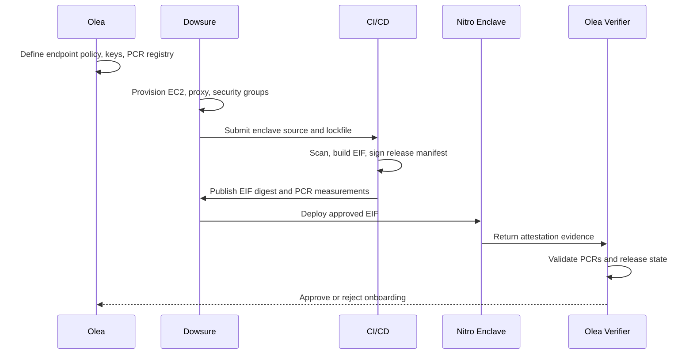
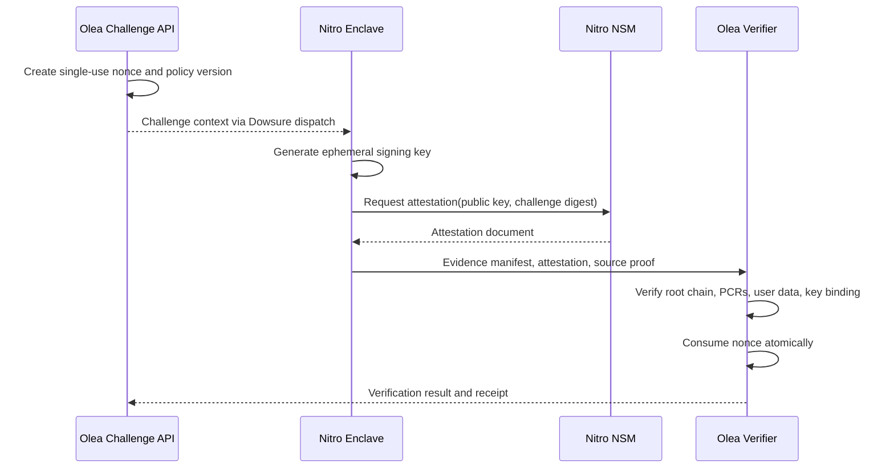
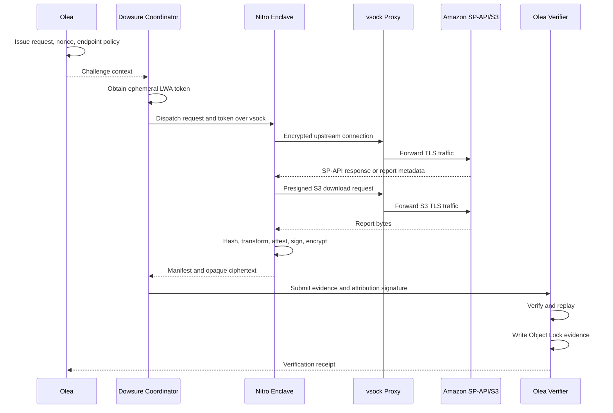
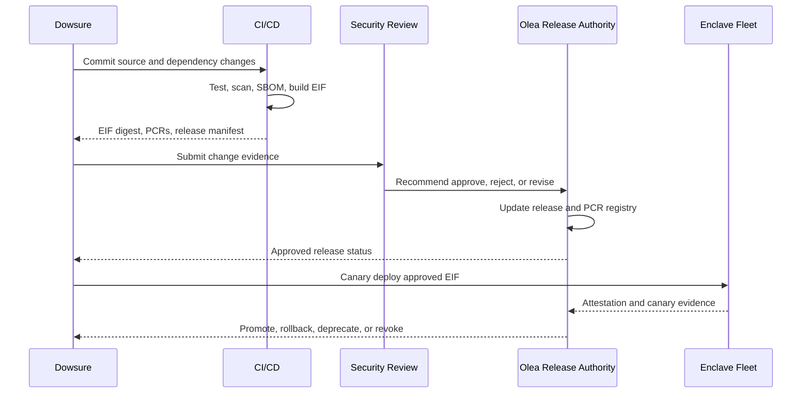

# Olea-Dowsure Verifiable Data Oracle

## Executive Proposal and Two-Week Implementation Plan

**Audience:** Olea senior leadership, engineering, security, risk, and operations stakeholders  
**Delivery target:** Controlled PoC and integration-ready implementation in approximately two weeks  
**Status:** Decision-ready proposal; production remains gated by endpoint compatibility and evidence quality

---

## 1. Executive Summary

Olea currently depends on Dowsure to retrieve Amazon Selling Partner API (SP-API) and selected KYC-provider data. A Dowsure signature proves only that Dowsure signed a package. It does not independently prove that Amazon or the KYC provider returned the submitted values, that records were not removed, or that approved code performed the transformation.

The proposed solution creates a verifiable data path:

```text
Upstream provider
    -> authenticated source interaction and source proof
    -> Dowsure-hosted AWS Nitro Enclave
    -> canonical hash and approved deterministic transformation
    -> attestation-bound evidence signature
    -> Olea-controlled verifier and policy registry
    -> immutable evidence vault
    -> underwriting and funder assurance
```

The design separates trust into four layers:

1. **Source authenticity:** provider-native proof where genuinely available; otherwise an Olea-approved TLSNotary or equivalent mechanism.
2. **Execution authenticity:** Nitro Enclave attestation, approved PCR measurements, and an attested ephemeral signing key.
3. **Lineage integrity:** raw-source hash, deterministic transformation manifest, replayed output hash, and evidence signature.
4. **Acceptance and retention:** Olea-controlled verification, fail-closed decisions, immutable retention, and linkage to financing decisions.

### Executive summary table

| Area | Recommendation | Leadership implication |
| --- | --- | --- |
| Business objective | Make financing-relevant source data independently verifiable | Reduces reliance on an operational intermediary's assertion |
| Dowsure role | Operate credentials, parent EC2, proxy, and Nitro Enclave acquisition path | Dowsure owns availability and execution operations |
| Olea role | Own policy, verifier, trusted keys/PCR registry, acceptance, and evidence vault | Olea retains cryptographic and risk authority |
| SP-API authentication | Use LWA OAuth access tokens; do not design around SigV4 | Token handling and privacy controls are central |
| Data acquisition | Synchronous APIs for bounded recent data; Reports API for historical bulk data | The PoC must validate both paths where applicable |
| Large report handling | Download, decompress, hash, parse, and transform inside the enclave | Presigned S3 URLs and proxy allowlists are critical dependencies |
| Source proof | Do not assume Amazon payload signatures; prove the exact endpoint interaction | Metadata-only proof does not automatically prove report bytes |
| Privacy | Prefer non-PII Orders and Finances fields; avoid RDT by default | Limits regulatory exposure and evidence retention burden |
| Two-week outcome | Feasible for a controlled PoC and integration-ready slice | Not sufficient for full production hardening, scale, or multi-provider rollout |
| Go-live gate | Require endpoint compatibility, evidence replay, attestation validation, immutable retention, and security signoff | Failed controls exclude the endpoint or require an explicit residual-risk decision |

### Expected outcome

At the end of the two-week effort, leadership should have:

- one or two validated SP-API acquisition flows
- a functioning Dowsure Nitro Enclave PoC
- an Olea challenge, verification, and evidence-retention path
- a machine-verifiable evidence package
- a responsibility model and operating runbook
- documented evidence for the production go/no-go decision

### Recommendation

Approve a tightly scoped two-week PoC with one synchronous or bounded SP-API flow and one asynchronous Reports API flow if the selected endpoints are available. Do not represent the outcome as production-ready until the source-proof boundary for report bytes, attestation governance, privacy controls, operational support, and failure handling have passed review.

The assurance case has two independent chains: the **data chain** (Amazon/KYC source proof -> raw-source hash -> approved transformation -> Olea receipt) and the **code chain** (approved EIF -> Nitro attestation/PCRs -> attestation-bound evidence signature). A Dowsure signature supports attribution and submission non-repudiation; it does not replace either chain.

The target operating model should also produce a standalone funder verification package containing source proof, source and output hashes, transformation manifest, Dowsure and enclave signatures, Nitro attestation, Olea receipt, timestamps, and immutable-storage evidence, without exposing credentials or unnecessary PII.

The scheduled-financial-transaction integration is covered by the same model: each qualified transaction may carry a `receipt_hash` in the financing Excel, while `integrity_metadata.json` carries canonical data, source-proof references, transformation version, and request-level completeness evidence. Transaction IDs and posted dates support reconciliation but are not source proof by themselves.

---

## 2. Architecture Review

### 2.1 Proposed architecture

```text
+----------------------+        +----------------------+        +----------------------+
| Amazon / KYC source  | HTTPS  | Dowsure AWS account  | vsock  | Olea control plane    |
| SP-API and report S3 |------->| Parent + Enclave     |------->| Challenge + Verifier  |
+----------------------+        | Acquire/hash/sign    |        | Policy + Vault        |
                                +----------------------+        +----------------------+
                                                                  |
                                                                  v
                                                       Underwriting / Funder
```

The parent EC2 instance is a coordinator and encrypted network forwarder. The Nitro Enclave is the trusted acquisition and transformation boundary. Olea is the independent verifier and policy authority.

### 2.2 Validated assumptions

- Nitro Enclaves provide isolated CPU and memory, no virtual NIC, no persistent storage, and vsock communication with the parent.
- The parent proxy can forward encrypted traffic without terminating and reconstructing the source TLS session.
- Dowsure can provide an ephemeral LWA access token to the enclave without persisting it in the EIF, logs, or ordinary host storage.
- Olea can operate a challenge and verification service with atomic nonce state.
- Olea can maintain an approved PCR and release registry and verify Nitro attestation documents.
- The selected SP-API endpoints permit the intended non-PII access pattern and are available to the Dowsure account.
- The transformation is deterministic and can be replayed by Olea.

### 2.3 Critical gaps and risks

| Finding | Impact | Recommendation | Owner |
| --- | --- | --- | --- |
| Amazon does not provide ordinary payload signatures | A Dowsure signature alone cannot establish source authenticity | Validate exact source-proof capability per endpoint; reject unsupported endpoints by default | Olea + Dowsure |
| TLSNotary on large S3 reports is impractical | Proof may exceed memory, bandwidth, or presigned URL lifetime | Use Nitro-controlled acquisition for large artifacts; explicitly approve or reject the S3 artifact trust boundary | Olea Security |
| Presigned S3 hosts are dynamic | Enclave acquisition can fail even when SP-API access works | Test and document regional SP-API and S3 proxy allowlists | Dowsure |
| LWA token handling is sensitive | Leakage could expose seller data and source access | Keep tokens ephemeral, scoped, memory-only, and absent from logs | Dowsure |
| RDT and consumer PII are unnecessary for underwriting | Retention creates privacy and compliance exposure | Establish a non-PII policy and block RDT by default | Olea Risk/Privacy |
| PCR changes can invalidate evidence | Deployment or rebuild can cause unexpected rejection | Use signed EIF manifests, PCR approval, status, rollback, and release windows | Olea + Dowsure |
| Parent host can affect availability | A compromised host may interrupt or delay acquisition | Treat availability as an operational risk; keep integrity decisions inside Olea verification | Dowsure |
| Verifier or policy compromise is high impact | A compromised verifier could accept bad evidence | Separate duties, protect signing keys, audit policy changes, and maintain revocation | Olea |
| Two weeks is aggressive | Production hardening can be rushed | Define the deliverable as PoC plus integration-ready controls, not full production scale | Steering group |

### 2.4 Nitro Enclave usage validation

Nitro Enclaves are being used correctly when:

- the EIF contains approved code and no long-lived credentials
- the parent communicates over vsock only
- the enclave has no external network interface
- the parent forwards encrypted traffic and does not terminate the trusted source TLS session
- the enclave obtains, hashes, and transforms the raw source before emitting evidence
- an ephemeral public key is bound to the Nitro attestation document
- Olea validates the attestation chain and PCRs against an Olea-controlled registry
- evidence is rejected when the enclave release, nonce, signature, or transformation is invalid

Nitro attestation does **not** prove that Amazon returned the data. It proves the identity and measurements of the enclave that processed the data. Source proof and execution proof must remain separate.

### 2.5 Architecture improvements required before production

1. Define a source-policy record for every endpoint: domain, operation, parameters, proof type, disclosure fields, freshness, rate limits, and failure behavior.
2. Define a canonicalization specification shared by enclave and Olea verifier. JSON stringification is insufficient.
3. Make nonce consumption atomic and single-use.
4. Encrypt evidence to Olea before it leaves the trusted enclave boundary if the parent must not inspect raw data.
5. Maintain a signed EIF release manifest containing image digest, version, commit, PCR measurements, build identity, supported endpoints, and revocation state.
6. Require immutable-vault success before releasing a verification receipt to underwriting.
7. Treat metadata-only TLSNotary evidence as metadata evidence, not proof of report contents.

---

## 3. Responsibility Matrix

### 3.1 Responsibility model

| Responsibility | Olea | Dowsure | Shared / gate |
| --- | --- | --- | --- |
| AWS account ownership | Own verification, policy, vault, and underwriting integration account | Own acquisition account, parent EC2, enclave fleet, and source access | Cross-account trust is documented and least-privilege |
| Infrastructure provisioning | Challenge API, verifier, policy registry, vault, KMS for Olea evidence | Nitro-capable EC2, enclave runtime, proxy, networking, service roles | Infrastructure as code and peer review required |
| IAM configuration | Olea verifier, vault, policy, and key policies | Parent, enclave support, proxy, and source-access roles | No shared admin credentials; least privilege and break-glass audit |
| KMS configuration | Evidence encryption keys, vault keys, verifier key protection | Source-token release integration if required; no key material in EIF | Key policy and attestation conditions jointly reviewed |
| Nitro Enclave setup | Approve EIF requirements and PCR policy | Build, deploy, operate, and monitor enclave | Olea registers approved PCRs and release state |
| Attestation validation | Verify Nitro root, PCRs, user data, public key, and release | Supply attestation document and evidence binding | Negative tests required |
| Application development | Verifier, policy, challenge, receipt, vault, underwriting integration | Acquisition, proxy, enclave, source proof, transformation, packaging | Shared schema, contract tests, and code review |
| CI/CD | Verify policy and verifier releases; approve trust registry changes | Build/sign EIF, publish release metadata, deploy approved artifacts | Signed artifacts, provenance, rollback, segregation of duties |
| Security review | Own acceptance criteria, threat model, privacy, and residual risk | Provide threat evidence, configurations, scans, and remediation | Joint security gate before PoC exit |
| Monitoring and alerting | Verification failures, policy changes, nonce replay, vault failures | Enclave health, proxy failures, source throttling, token errors, latency | Shared correlation IDs and incident severity model |
| Operational support | Verification service, vault, policy, receipt, underwriting integration | Acquisition service, EC2, enclave, proxy, source connectivity | 24x5 or agreed coverage and escalation path |
| Incident management | Evidence acceptance, verifier compromise, policy/key incidents | Runtime, credential, infrastructure, and source-access incidents | Joint incident commander and evidence preservation |
| Key rotation | Olea verifier, vault, policy, and signing keys | Dowsure submission and operational keys | Rotation tested; old keys revoked only after migration evidence |
| Testing and signoff | Acceptance, security, privacy, and business signoff | Functional, performance, enclave, and operational evidence | Joint go/no-go decision |

### 3.2 Final RACI matrix

### RACI legend

R = Responsible, A = Accountable, C = Consulted, I = Informed

| Activity | Olea | Dowsure | Security/Risk | Leadership |
| --- | ---: | ---: | ---: | ---: |
| Approve business scope and PoC endpoints | A | R | C | I |
| Define source-proof and disclosure policy | A/R | C | C | I |
| Provision Olea verifier and vault | A/R | I | C | I |
| Provision Dowsure EC2 and enclave runtime | I | A/R | C | I |
| Build and sign EIF | C | A/R | C | I |
| Register PCR and release | A/R | C | C | I |
| Configure source credentials and LWA flow | I | A/R | C | I |
| Configure KMS and key policies | A/R | R | C | I |
| Implement acquisition and transformation | C | A/R | C | I |
| Implement verification and acceptance | A/R | C | C | I |
| Execute functional and negative tests | A | R | C | I |
| Perform security and privacy review | A | R | A/R | I |
| Operate monitoring and response | A/R for Olea services | A/R for Dowsure services | C | I |
| Approve residual-risk exceptions | A | C | R | I |
| Production go/no-go | R | R | C | A |

---

## 4. End-to-End Workflow

### 4.1 Initial environment setup

1. Olea defines the selected endpoints, proof requirements, disclosure fields, freshness, transformation, and rejection policy.
2. Olea provisions the challenge API, policy registry, verifier, evidence vault, and Olea KMS keys.
3. Dowsure provisions Nitro-capable EC2, enclave support packages, vsock proxy, security groups, and least-privilege runtime roles.
4. Both parties exchange service identities, endpoint allowlists, public keys, and environment metadata through an approved channel.
5. Security validates that no long-lived credentials are embedded in the EIF or stored in the parent image.

**Input:** approved scope and endpoint policy.  
**Output:** isolated dev/PoC environments, policies, keys, and network path.  
**Trust boundary:** Olea controls acceptance; Dowsure controls runtime availability.

### 4.2 EIF build and sharing

1. Dowsure builds the enclave application from a pinned commit and dependency lockfile.
2. CI scans source and dependencies, produces an SBOM, signs the build metadata, and creates the EIF.
3. Dowsure records the EIF digest, version, commit, build identity, and PCR measurements.
4. Olea reviews the release manifest, source changes, test results, and expected PCRs.
5. Olea registers the approved PCRs and release status as active, deprecated, or revoked.
6. Dowsure deploys only the approved EIF digest and reports the deployment evidence.

**Security control:** Olea does not trust a version label; it trusts the signed release metadata and attested measurements.

### 4.3 Attestation verification

1. Olea issues a single-use challenge with request ID, nonce, endpoint, policy version, disclosure policy, and expiry.
2. Dowsure passes the approved request and ephemeral LWA token to the enclave over vsock.
3. The enclave generates an ephemeral signing key pair.
4. The enclave requests a Nitro attestation document binding the public key and challenge digest.
5. The evidence bundle includes the attestation document and signed manifest.
6. Olea verifies the Nitro root chain, PCRs, user data, public key binding, release state, and nonce.

### 4.4 Runtime transaction flow

1. Dowsure requests a challenge from the Olea Challenge API with the financing and endpoint context.
2. Olea issues the nonce, policy version, endpoint scope, disclosure rules, and expiry; Dowsure receives the challenge.
3. Dowsure exchanges or retrieves an ephemeral LWA access token.
4. The enclave executes either a bounded synchronous API call or the Reports API workflow.
5. For reports, the enclave creates the report, polls status, retrieves document metadata, downloads the presigned S3 artifact through the proxy, decompresses it, and hashes it before transformation.
6. The enclave applies only the approved deterministic transformation.
7. The enclave signs the manifest and encrypts the evidence payload to Olea.
8. Dowsure transports the manifest and opaque ciphertext to Olea and adds its submission signature.
9. Olea atomically consumes the nonce, validates source proof, attestation, hashes, transformation replay, freshness, completeness, and schema.
10. Olea writes the accepted package to Object Lock storage and returns a verification receipt to underwriting.

### 4.5 Monitoring and operations

- Dowsure monitors enclave availability, vsock failures, proxy failures, SP-API throttling, report status delays, S3 download errors, LWA errors, and latency.
- Olea monitors rejected evidence, nonce replay attempts, PCR mismatches, invalid signatures, policy changes, vault failures, verifier health, and underwriting receipt latency.
- Both parties correlate events using request ID, evidence ID, nonce hash, and source operation. Secrets and raw PII are never logged.

### 4.6 Upgrade and change management

1. A party raises a change request with scope, risk, rollback, test evidence, and impacted policies.
2. Dowsure builds a new EIF and release manifest.
3. Security and Olea review source changes, dependencies, SBOM, PCR changes, and endpoint impact.
4. Olea registers the release as active only after approval.
5. Dowsure deploys progressively and reports attestation measurements.
6. Olea verifies a canary evidence package before broad use.
7. The previous release remains available during the migration window, then is deprecated or revoked.

---

## 5. Sequence Diagrams

### 5.1 Initial onboarding and setup



### 5.2 Attestation verification flow



### 5.3 Runtime request flow



### 5.4 Deployment and change process



---

## 6. Two-Week Project Plan

This plan targets a controlled PoC and integration-ready implementation. It does not promise full production scale, multi-region resilience, complete funder tooling, or broad endpoint expansion within two weeks.

| Phase | Duration | Activities | Deliverables | Dependencies | Exit criteria |
| --- | ---: | --- | --- | --- | --- |
| 1. Alignment and approval | 1 day | Confirm endpoints, business use case, data fields, threat model, proof policy, and decision rights | Approved scope, architecture decision, initial source-policy records, named owners | CTO/leadership availability; Dowsure endpoint access | Olea and Dowsure approve scope and acceptance criteria |
| 2. Infrastructure and enclave setup | 2 days | Provision Olea verifier/vault; provision Dowsure EC2, proxy, enclave tooling, IAM, KMS, and network allowlists | Running environments, IAM/KMS policies, proxy path, initial EIF build pipeline | AWS accounts, quotas, credentials, endpoint allowlists | Enclave starts; vsock and approved egress work; no secret leakage in tests |
| 3. PoC validation and security testing | 3 days | Execute synchronous and/or Reports API path; test LWA, S3, attestation, PCRs, nonce, source proof, privacy, negative cases | Evidence packages, attestation test results, threat findings, latency/rate-limit results | Phase 2 complete; selected SP-API access | Olea independently accepts valid evidence and rejects tampered, stale, replayed, or unapproved evidence |
| 4. Application and integration development | 3 days | Implement challenge API, source-policy lookup, enclave acquisition, transformation, evidence encryption, verifier, receipt, and underwriting integration | Integration-ready service slice, schemas, APIs, dashboards, runbooks | Stable PoC findings and approved schemas | End-to-end happy path works with machine-verifiable evidence |
| 5. End-to-end and operational readiness | 2 days | Run failure, replay, release, rollback, retention, monitoring, incident, and support tests | Test report, operating procedures, alert rules, escalation matrix, residual-risk register | Integrated services and test data | Operational owner accepts support model; critical defects closed or explicitly waived |
| 6. Go-live readiness review | 1 day | Review evidence, security/privacy results, open risks, support, rollback, and business acceptance | Go/no-go decision pack, production backlog, signed acceptance or exception record | All phase deliverables | Leadership approves PoC completion and next production step |

### Milestone view

```text
Day-equivalent 1   Scope, architecture, owners, security criteria approved
Day-equivalent 3   Infrastructure, IAM/KMS, proxy, and enclave path working
Day-equivalent 6   Source proof, attestation, replay, privacy, and negative tests complete
Day-equivalent 9   Application and Olea-Dowsure integration slice complete
Day-equivalent 11  E2E, monitoring, rollback, and operational readiness complete
Day-equivalent 12  Go/no-go review and production backlog agreed
```

The plan has little slack. Endpoint access, TLSNotary compatibility, AWS quota, KMS policy approval, and availability of both engineering teams are the critical path.

---

## 7. RAID Analysis

### Risks

| ID | Risk | Impact | Mitigation | Owner |
| --- | --- | --- | --- | --- |
| R1 | Selected SP-API endpoint cannot produce acceptable source proof | High | Test exact endpoint immediately; exclude or document residual risk | Olea + Dowsure |
| R2 | TLSNotary cannot support endpoint TLS, headers, or response size | High | Test compatibility in Phase 3; use approved bounded endpoint or change proof approach | Olea Security |
| R3 | Presigned S3 URL expires during acquisition | High | Download immediately inside enclave; stream and measure timing | Dowsure |
| R4 | PCR changes invalidate release | Medium | Signed EIF manifest, PCR registry, canary, rollback | Olea + Dowsure |
| R5 | LWA token or PII is logged | High | Memory-only handling, log filtering, negative tests, no RDT by default | Dowsure |
| R6 | Two-week scope expands | High | Freeze one or two endpoints; leadership controls change requests | TPM |
| R7 | Verifier or policy key compromise | High | Separation of duties, KMS controls, audit, rotation, revocation | Olea Security |
| R8 | Source rate limits cause unreliable tests | Medium | Bounded queries, Reports API, backoff, test windows | Dowsure |

### Assumptions

| ID | Assumption | Validation | Owner |
| --- | --- | --- | --- |
| A1 | Dowsure has an AWS account and Nitro-capable capacity | Confirm before Phase 2 | Dowsure |
| A2 | Olea can provision a verifier and Object Lock vault | Confirm account, region, KMS, and quota | Olea |
| A3 | Selected SP-API scopes permit non-PII data | Review application roles and seller consent | Dowsure + Olea |
| A4 | A deterministic transformation can be defined quickly | Freeze schema and test vectors in Phase 1 | Olea + Dowsure |
| A5 | Teams can provide daily decision turnaround | Nominate accountable leads and escalation path | Leadership |

### Issues requiring immediate resolution

| ID | Issue | Required decision | Owner | Due in plan |
| --- | --- | --- | --- | ---: |
| I1 | Exact PoC endpoint and report type are not named in the documents | Select one bounded endpoint and one report flow, or explicitly select only one | Olea + Dowsure | Phase 1 |
| I2 | Report-byte trust model after metadata proof is not yet demonstrated | Accept direct artifact proof, or record residual-risk exception | Olea Security | Phase 3 |
| I3 | AWS accounts, regions, quotas, and contacts are not recorded | Confirm environment inventory and escalation contacts | Dowsure + Olea | Phase 1 |
| I4 | Production retention period and PII legal basis are not finalized | Approve retention and privacy policy before production | Olea Risk/Legal | Phase 1 |

### Dependencies

| ID | Dependency | Owner | Blocking condition |
| --- | --- | --- | --- |
| D1 | SP-API seller consent, credentials, roles, and LWA client | Dowsure | No source calls without approved access |
| D2 | Nitro-capable EC2, enclave tooling, and AWS quotas | Dowsure | No enclave PoC |
| D3 | Olea verifier, policy registry, KMS, and Object Lock vault | Olea | No independent acceptance or evidence retention |
| D4 | Approved EIF release and PCR registry | Both | Evidence rejected as untrusted |
| D5 | Security, privacy, and underwriting signoff | Olea | No production acceptance |
| D6 | Daily technical decision forum | TPM/Leadership | Timeline slips due to unresolved decisions |

---

## 8. Decision Log

| Decision | Position | Rationale |
| --- | --- | --- |
| Why Nitro Enclaves? | Use Nitro as the acquisition, transformation, and signing boundary | Provides hardware-backed execution identity and isolates source handling from the parent host |
| Why attestation? | Require attestation for every financing-relevant evidence package | Proves the approved enclave measurement and binds the ephemeral signing key to the execution |
| Is TLS required? | TLS is mandatory for all upstream and submission traffic; TLS termination inside an untrusted parent proxy is prohibited | Encryption in transit protects credentials and data; source proof may additionally use TLSNotary or a provider-native mechanism |
| What does attestation prove? | It proves enclave identity, measurements, and binding of user data/public key | It does not prove that Amazon returned the payload; source proof remains separate |
| How are EIFs versioned? | Signed release manifest with immutable digest, commit, SBOM, PCRs, endpoint support, status, and verifier minimum version | Prevents trust based on mutable tags and supports rollback/revocation |
| How are deployments approved? | Dowsure builds and proposes; Olea reviews and registers PCR/release; Dowsure deploys the approved digest | Separates operational deployment from trust authority |
| How is trust established? | Olea owns verifier policy and acceptance; Dowsure supplies operational evidence from an attested enclave; both use explicit schemas and keys | Neither party can unilaterally convert an invalid package into accepted evidence |
| What is Dowsure signature for? | Attribution and submission non-repudiation only | It is not source authenticity proof |
| What is the default privacy posture? | Non-PII SP-API data; no RDT unless expressly approved | Minimizes regulatory and retention exposure |
| What is the production gate? | Exact endpoint compatibility and independent evidence replay | Architecture approval alone is insufficient |
| Is TLSNotary an alternative? | Yes, for bounded responses only after endpoint/TLS compatibility testing; metadata-only proof does not prove large report bytes | Adds notary, proxy, key, latency, and availability responsibilities |
| Who hosts the enclave for the PoC? | Recommend Dowsure-hosted unless Olea already has ready Nitro infrastructure; Olea retains release and verification authority | Fastest path, with explicit PCR, KMS, EIF, and no-side-path controls |

---

## 9. Operational Model

### Day-2 support

**Dowsure owns:**

- parent EC2 and enclave availability
- source credential and LWA operational health
- vsock proxy, DNS, network, and S3 allowlist
- report polling, throttling, retries, and source connectivity
- enclave fleet deployment, rollback, and runtime metrics

**Olea owns:**

- challenge and nonce service
- source-policy and PCR/release registries
- verifier availability and correctness
- KMS keys for verification and evidence
- Object Lock vault and verification receipts
- underwriting integration and acceptance decisions

**Shared:**

- incident bridge and escalation
- schema and contract changes
- release coordination
- security findings and residual-risk decisions
- evidence preservation and post-incident review

### Monitoring requirements

| Signal | Owner | Alert condition |
| --- | --- | --- |
| Enclave launch and health | Dowsure | Launch failure, unexpected restart, capacity exhaustion |
| vsock/proxy connectivity | Dowsure | Connection failures, denied host, TLS handshake errors |
| LWA and SP-API errors | Dowsure | Authentication failure, 429 rate limit, elevated 5xx |
| Report lifecycle | Dowsure | Stuck report, expired URL, decompression or parse failure |
| Attestation/PCR mismatch | Olea | Any unapproved measurement or release |
| Source-proof failure | Olea | Invalid, missing, stale, or wrong-source proof |
| Nonce replay | Olea | Reused, expired, or mismatched challenge |
| Transformation mismatch | Olea | Replay output hash differs |
| Vault/Object Lock failure | Olea | Storage receipt missing or object not locked |
| Receipt latency | Shared | Underwriting SLA breach |

### Logging approach

- Use structured JSON logs with request ID, evidence ID, source operation, result, and latency.
- Never log LWA tokens, refresh tokens, private keys, raw PII, full presigned URLs, or source payloads.
- Log hashes and redacted host metadata only where required for troubleshooting.
- Apply retention, access controls, and CloudTrail to verifier, policy, KMS, and vault operations.
- Preserve rejected evidence metadata and reason codes without retaining unnecessary sensitive payloads.

### Incident response

1. Detect and classify the event by integrity, confidentiality, availability, or privacy impact.
2. Freeze affected endpoint acceptance and preserve evidence IDs, manifests, logs, and release metadata.
3. Revoke impacted EIF releases, keys, policies, or credentials where required.
4. Determine whether accepted evidence or underwriting decisions are affected.
5. Notify the joint incident commander, security, risk, legal, and leadership according to severity.
6. Recover using a known-good release and re-verify affected evidence.
7. Complete a post-incident review and update the source policy or controls.

### Patch and release management

- Patch parent hosts, enclave dependencies, proxy components, and verifier dependencies through a tested release pipeline.
- Rebuild EIFs from pinned dependencies and record new PCRs.
- Do not register new PCRs automatically from CI.
- Use canary evidence, rollback, deprecation, and revocation states.
- Emergency security releases may bypass normal duration but require retrospective review and evidence preservation.

---

## 10. Final Recommendation

### Feasibility within two weeks

**Yes, for a controlled PoC and integration-ready vertical slice. No, for fully hardened production across multiple endpoints, regions, providers, and funders.** The two-week target is achievable only with a frozen scope, named owners, daily decisions, existing AWS access, and immediate endpoint compatibility testing.

### Olea must complete

- appoint the accountable product, architecture, security, and operations owners
- define the exact endpoint policy, disclosure fields, freshness, retention, and acceptance rules
- provision challenge, verifier, policy, KMS, and Object Lock capabilities
- register approved EIF/PCR releases and source-policy entries
- validate evidence independently and provide signoff or residual-risk decisions
- connect verification receipts to underwriting and define day-2 support

### Dowsure must complete

- provide source credentials, seller consent, LWA flow, and endpoint access
- provision Nitro-capable EC2, enclave runtime, proxy, allowlists, and monitoring
- build and sign the approved EIF and provide reproducible release evidence
- implement source acquisition, report handling, transformations, and encrypted evidence packaging
- demonstrate no out-of-enclave raw-data handling or secret logging
- provide operational support, test results, rollback, and incident contacts

### Biggest timeline risks

1. Endpoint proof or TLS compatibility fails after implementation begins.
2. Report-byte authenticity remains unresolved when only metadata is notarized.
3. AWS account, quota, KMS, or seller-consent dependencies are delayed.
4. Responsibilities remain shared without a single accountable owner.
5. Scope expands beyond one or two endpoints.
6. Security, privacy, or legal approval is deferred until the end of the schedule.

### Fastest path to production

1. Freeze one bounded non-PII SP-API endpoint and one report flow.
2. Prove the exact source-proof and S3 artifact trust model before building broad application features.
3. Build the smallest vertical slice: challenge -> enclave acquisition -> evidence package -> Olea verification -> immutable receipt.
4. Use signed EIF manifests, atomic nonce state, deterministic test vectors, and negative tests from the first build.
5. Run daily joint reviews and resolve blockers within one working session.
6. Treat any failed control as an endpoint exclusion or explicit residual-risk decision, not as an undocumented workaround.

**Executive decision requested:** approve the two-week controlled PoC, nominate one accountable lead from Olea and Dowsure, confirm the initial endpoints and AWS environments, and authorize a daily decision forum with security and risk participation.

---

## Appendix A: Minimum Evidence Package

```text
EvidenceBundle/
  evidence-manifest.json
  source-response-or-report.bin
  source-proof.bin
  source-metadata.json
  transformation-manifest.json
  transformed-output.json
  nitro-attestation.cbor
  signatures/
    enclave.sig
    dowsure.sig
  timestamps.json
  verification-report.json
  immutable-storage-receipt.json
```

The manifest must bind the request ID, nonce, source and operation, request parameters, proof type, raw hash, transformation version, output hash, attestation, PCRs, enclave public key, enclave signature, Dowsure signature, policy version, and verification result.

## Appendix B: Non-Negotiable Acceptance Controls

- No accepted package without source proof or an explicitly approved residual-risk exception.
- No accepted package from an unapproved PCR or revoked EIF.
- No accepted package with an expired, reused, or mismatched nonce.
- No accepted package whose raw or transformed hash cannot be independently reproduced.
- No accepted package whose report bytes were handled outside the approved enclave boundary.
- No underwriting release before immutable evidence retention succeeds.
- No production expansion until exact endpoint compatibility is demonstrated.
